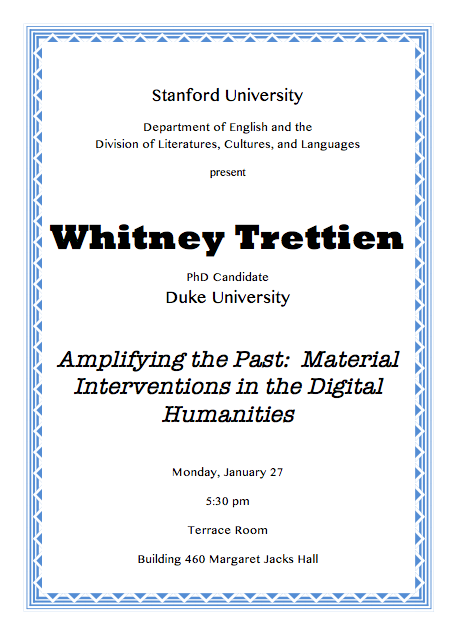

Date/Time: Monday, 27 January 2014 - 5:30pmLocation: Terrace Room, Bldg. 460 (Margaret Jacks Hall)

This talk by Whitney Trettien (PhD candidate, Duke University) is sponsored by the Stanford's Department of English and Division of Literatures, Cultures, and Languages.

