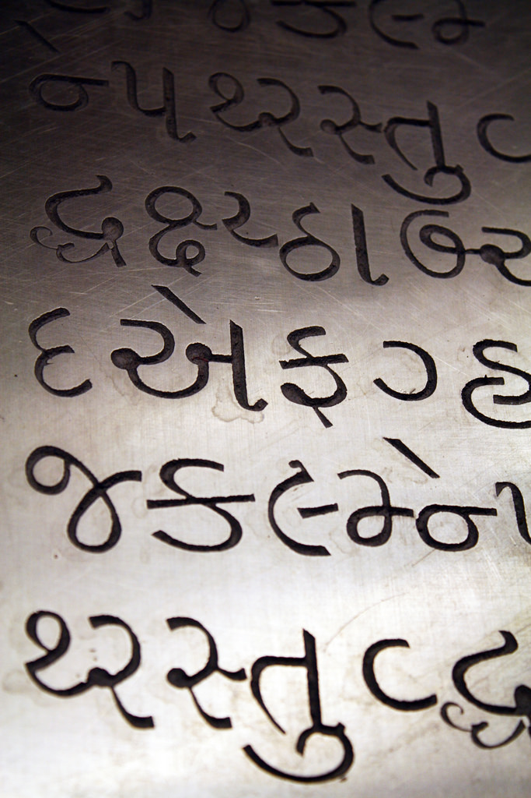

Date/Time: Tuesday, 22 January 2019 - 1:30pm to 3:00pmLocation: Lathrop 120

Debbie Anderson of the [Script Encoding Initiative](http://www.linguistics.berkeley.edu/sei/index.html) at UC Berkeley will speak about the research that goes into developing a proposal for adding new scripts and characters to the universal Unicode standard. Unicode is essential for ensuring that texts can display correctly across different file formats, digital environments, and devices. This talk will be of particular interest to scholars who work on medieval manuscripts (which can require "non-standard" characters for accurate transcription), scholars who work with minority languages, and scholars doing digital humanities work-- especially in multiple languages.

