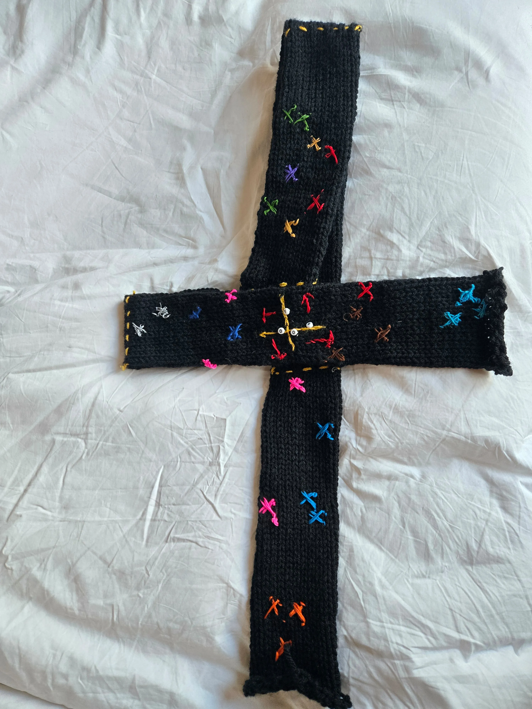
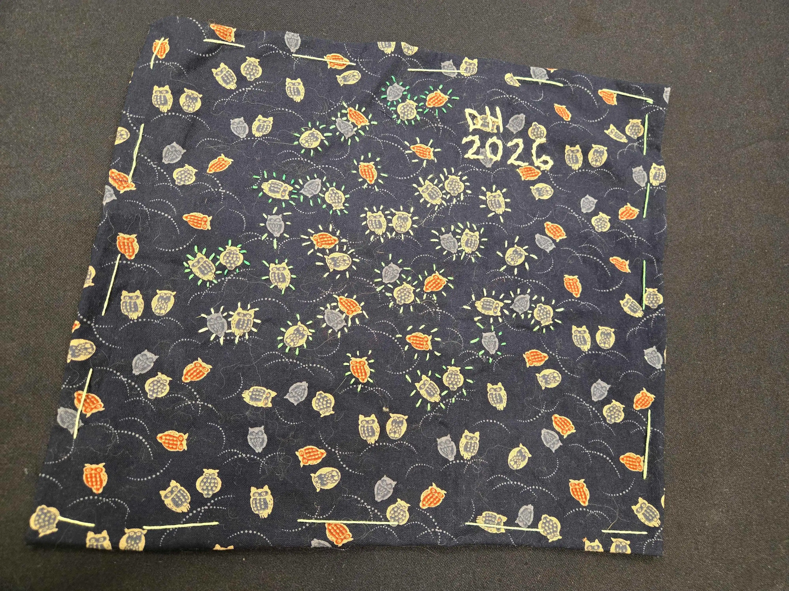
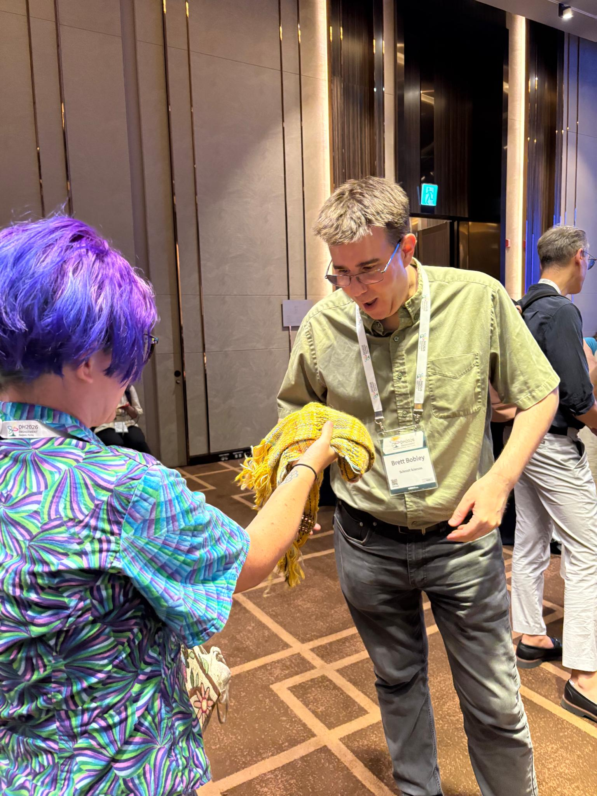
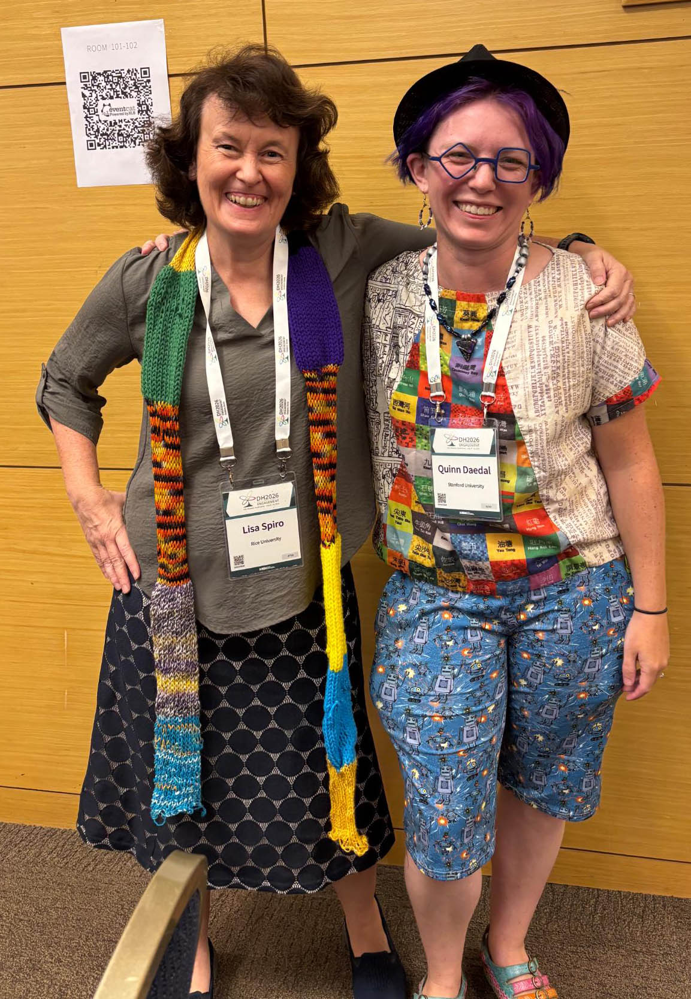

The summer conference season is over, and this year marked a return for me to both the international DH conference (held in Daejeon, South Korea for 2026) and the ACH conference (held, as usual, anywhere you are / virtually). They're always different experiences, but the distinction felt particularly acute this year. 

Maybe it was the effect of taking a year off from DH during a time when there's been tremendous growth in AI adoption, or maybe it was the conference location and the local DH cultures in Asia (which were much more represented than in past years at the conference), but AI felt very central and omnipresent at DH 2026. Sometimes this had positive effects: while the implementation could be a little clunky, this was the first year I saw numerous talks given in the speaker's native, non-English language. There was a QR code on the wall that you could scan to get a live machine transcription and translation, accompanying slides that were generally in English or with minimal text. I can't conclusively vouch that it was *good* — one thing about AI transcription and translation is that it reliably produces things that *see plausible* even if it's not at all correct. But it felt noteworthy that we've reached a point where the technology is good enough that people can reasonably make the choice to present in a language that is more comfortable for them than English. I'd like to imagine that [past efforts like the DH 2014 "whispering" translation](https://elikaortega.net/blog/2014/dhwhisperer/) did important work to make that kind of presentation culturally acceptable within this community.

What felt less good was the number of talks in the genre "I used AI to do X". Yes, sometimes I use AI for things (specific code-writing bits, non-generative AI models for handwritten text recognition) but it's not generally what I would lead with in a talk. Then there were the conceptual talks, including the opening keynote, that took an inevitable AI ubiquity for humanities research as a starting point, to an extent I wouldn't agree with or be comfortable with myself. It made me miss the days of the spicy DH Twitter conference backchannel.

One thing I appreciate about the culture of ACH as an organization is that my own perspective on AI falls somewhere closer to the pro-AI side of the spectrum. There is an AI working group (which Meredith Martin and I passed on to Jeff Tharsen to run during this last year), and there are talks about work using AI, but there is nothing like a consensus viewpoint that AI is the answer to *anything*, let alone everything. If you want a space to do DH work where you won't get reviews back asking why you didn't just use an LLM for that, ACH is the place. It's an organization where critical craft work like we do with #DHmakes makes intuitive sense and doesn't face reflexive skepticism. I'm proud to have co-led ACH during a pivotal moment for the organization, and to see some of the things Roopika Risam and I put in place live on through subsequent waves of leadership. As much as ever, it feels like my organizational home.

ACH is also where I send my grad students. I co-presented with Nino Martin on the Global Medieval Sourcebook this year, and there was an entire panel on Ukrainian DH put together by Georgii Korotkov, Alyssa Virker, Liza Crim, and Valeriia Korotkova. Aurora Alagni presented on work she did in the DH practicum last fall, and Peter Cheng talked about the project he worked on throughout the winter and spring. Still, the grad student I'm most proud of here was Gary Huertas, who wrote a wonderful abstract that got accepted to the conference. When some challenges arose in the project, though, he made the difficult call to withdraw the paper and work on getting things sorted out with collaborators in person. It was a moment when it would have been easy to do the talk anyway, and get the academically-visible gold star for your CV, but he put his collaborators' concerns and needs first, and instead prioritized the hard work of doing a project in a way that makes everyone feel good. 

In a similar spirit, the talk I gave with Regina Pieck on AI-supported workflows for Nahuatl transcription ended up not being about major breakthroughs in AI (or about technology at all, really), but about how we had an idea, and when we started asking around we found a larger community already engaged in this work in different ways. Now we're excited to be part of that community, contributing the data and expertise we have towards a project that can both benefit and bring in more people. To me, this is where "digital humanities" still has a lot of value and strength: for all its interdisciplinary messiness, it's still a tent that brings people together and gets them talking to one another. Those relationships lead to better work, in the end, than the fanciest algorithm or AI model.

At both conferences, I was part of #DHmakes events: a "craft picnic" and mail exchange (organized by Sara Arribas-Colmenar) at ACH, and an all-day workshop at DH. Both were striking for how joyful they were. So many people were able to show up for the virtual picnic and talk through what they made for the mail exchange — including multiple people I had come across online but never synchronously spoken with before! The workshop at DH 2026 kept adding people throughout the day as folks wandered in and were invited to stay and make things. Nichole Nomura gave a wonderful workshop keynote contextualizing #DHmakes theoretically, which I hope she'll publish (as a zine, if nothing else) soon. She taught basic embroidery; I taught spinning and weaving; we also had materials for bobbin lace, hand- and machine-knitting and crochet, and zine-making. 

Throughout the conference I foisted craft supplies on anyone interested, and I was often not alone in making things during sessions. I used my insomnia hours to make a few dataviz scarves based on data I got from other conference attendees. Perhaps my favorite was for Jan Rybicki, who gave me a PCA and I figured out how to fold and embroider a knitted tube to make both a functional scarf and a readable PCA visualization. I also did two embroideries: an abstract version of the conference logo on superhero fabric for Jae-Yon Lee with 493 stitches for the 493 conference papers, and one with owls highlighted in green representing the 40 volunteers for Misun Yun. Seeing these textile data visualizations (both finished, and being made) seems to have sparked something for several of the people at the conference, who vowed to go home and make things from their data, too.

For myself, maybe the most meaningful moment was giving Brett Bobley—the former NEH program officer who started the Office of Digital Humanities and who I've known since the 2000's in my Project Bamboo Days — a weaving of 2006-2014 in NEH-ODH grants that I'd made for him to celebrate that office and maybe grieve a little. He was wearing it when he got on stage for his remarks at the reception for Schmidt Sciences, where he now funds major projects in humanities and AI. And his first words on stage were, "You guys, Quinn made me a scarf." Having an AI event start that way — leading with what is, in some ways, its opposite — left me feeling like we are, in fact, *on to something* with #DHmakes. There is something powerful and meaningful and so very human in this kind of work. It can take a critical and interpretive lens on data, but do it in a way that imbues it with something more. You can feel the love that went into it — or the hate, or the exasperation, and sometimes it's all of these things at once. It makes people care, in a way that a computer generated visualization can't. And tapping into that kind of caring has the potential to change things, as we discovered with SUCHO. There's more to think about here.

I'll conclude this conference write-up with the talk that Lisa Spiro and I gave together at DH 2026, expanding her classic 2012 *Debates in DH* piece proposing a set of "values" for DH. Much of it still feels relevant: "openness", "diversity", "collaboration, collegiality, connectedness". We expanded "experimentation" into "experimentation and play", and added "social engagement" (e.g. projects like SUCHO, Torn Apart/Separados, etc.), reflecting on the ways that the field has evolved over the last 15 years. We hope to write it up soon. The cultural things captured by this set of values make me happy to still be working in this field, even after all these years, and with the many challenges the field faces. Is there some center that can meaningfully continue to hold as pieces fragment off into "text and data mining", "cultural analytics", "data science", "AI", and several other things? I'd like to think those values might be it. It's a series of commitments to ourselves and to one another about *how we like to do things around here*, and that can persist well beyond even massive changes in technology or institutions.

