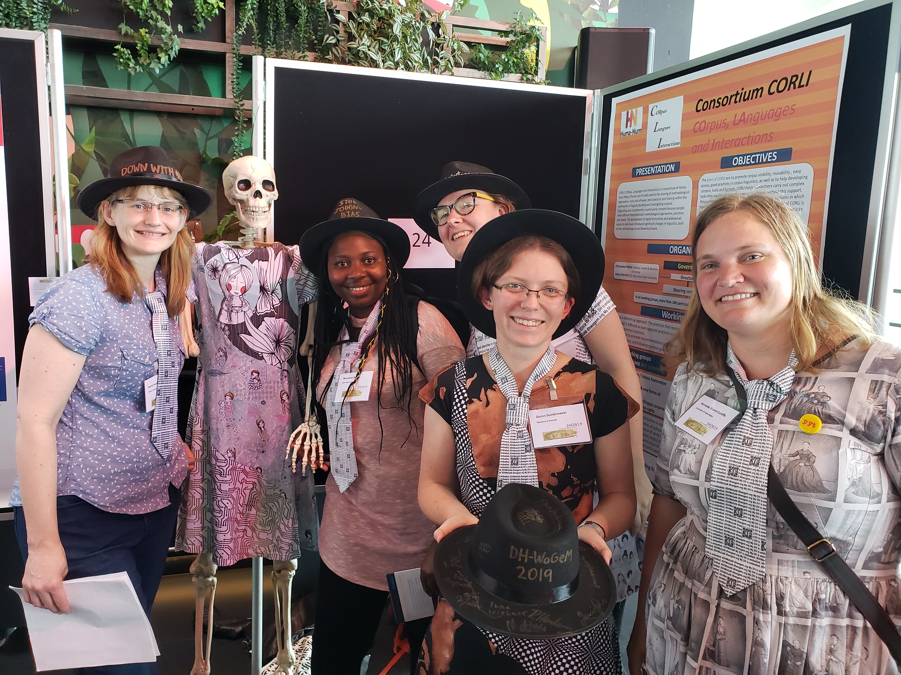
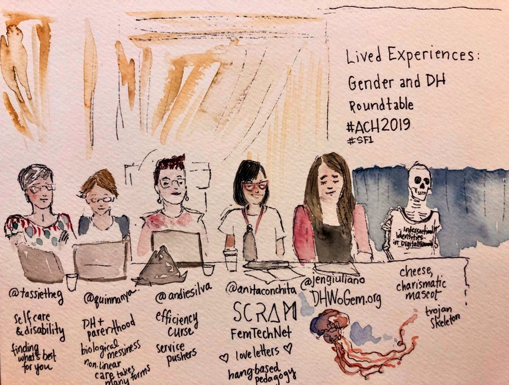

July was the month of digital humanities conferences, with DH 2019 in Utrecht, closely followed by ACH 2019 in Pittsburgh. I was fortunate enough to attend both, and the experience has left me reflecting on the different shapes that community takes within digital humanities.

My DH 2019 started with a workshop on doing DH in non-Latin scripts, which left me grateful that — other than the occasional Unicode issue — the script isn't a major challenge for doing work on Russian. The workshop mostly focused on Near Eastern (often right-to-left) writing systems, with some Chinese, Japanese, and Korean as well. While relatively little of it was directly relevant to projects I’m currently working on, I was glad to get a better sense of the current state of the art for optical character recognition, and approaches to text linking, annotation, and display that are geared towards non-Latin alphabets. Despite the linguistic diversity in the room, the workshop attendees had a surprisingly good rapport; many of us went out for drinks together that evening to continue the conversation. We decided to start an ad-hoc working group with a mailing list, a basic home page and a collection of resource lists that we’ll collectively maintain, including the guide to non-English NLP that I initially put together for a talk at UCLA last spring.

The DH pedagogy SIG workshop that I attended the second day also had a global focus, with brief talks that offered perspectives on teaching DH in Nigeria, in China, at a small branch campus near Pittsburgh, and using Jupyter notebooks for scholarly editions. It was striking how similar the stories were: regardless of the country or context, we all face similar challenges of fitting our work into established institutional structures, getting funding, and building community and capacity. No one, it seems, has really gotten these issues figured out, whether DH has been in “happening” at their institution for five years or twenty years. It makes me wonder, as we work towards shaping the various DH goings-on at Stanford into something resembling a more coherent program and community, if we might find value in partnering with another institution to collaborate on workshop curricula, share what’s working, and encourage one another.

DH 2019 was the biggest conference to date for the field, with over a thousand attendees. From the discussions I followed on Twitter, attendees’ experiences varied widely depending on what sessions they went to, and who they talked with. For me, the need for community (and simultaneously, the different ways that those communities are manifested) were major common themes throughout the conference. This included talks by Francesca Morselli about DARIAH working groups, Martin Grandjean on the development of Humanistica and the Francophone DH community, Gimena Del Rio Riande on an agile regional DH alliance within Latin America, Juan Steyn on developments in digital infrastructure in South Africa (which I watched with envy, given the state of DH infrastructure in the US), Felix Ameka on coming up with new frameworks for ethically analyzing data rooted in African culture and norms, and my own panel on Slavic DH with Yulia Ilchuk — where I spoke to the necessity of cultivating relationships with scholars working on the same languages in their countries of origin, if US-based Slavic DH scholars are going to stand a chance of getting tenure doing digital work. (I’ve posted [my remarks on that panel](http://quinndombrowski.com/blog/2019/07/12/future-slavic-dh-united-states), including calling out ASEEES for not doing more to signal support for digital work in Slavic and Eastern European studies.)

While not named explicitly, community was a major theme for the “out-of-the-box” / innovative poster group I helped organize as well. The poster was about [DH-WoGeM](http://dhwogem.org/), a group we brought into being last fall through the act of submitting conference proposals, which left us with a deadline for following through on the things we promised we'd do. We’ve held a number of synchronous, virtual “conversations” about topics including parenthood, happiness, and disability, and are following up on these topics in numerous ways, including a global survey on caring responsibilities in DH (e.g. childcare, caregiving for elderly parents or ill friends, self-care, etc), and a survey on workplace conflict, among others. When I saw there would be an award at DH for “out-of-the-box” or innovative posters, I knew we could win. I sewed the “poster" as a dress made to the measurements of Katie McDonough (my former History ATS colleague, now at the Turing Institute) — and I brought Cheese the Skeleton (so named by my oldest kid when he was 2) all the way to Utrecht to be the “body” of our “embodied DH” poster over the course of the week, when Katie was busy attending talks. If that weren’t enough, for the actual poster session we put out a call on the DH-WoGeM list for anyone who wanted to join us in a bit of cross-dressing with DH-WoGeM fedoras and ties (the latter becoming a most sought-after memento for male allies). This DH-WoGeM poster was one of the most joyful celebrations I’ve ever been involved with at a DH conference, and our quirky skeleton in the “Gender and Intersectional Identities in DH” dress had people taking and posting selfies — even folks who ordinarily would have nothing to do with the topic of gender. Needless to say, we won the innovative poster award hands-down, and will be putting the prize money (thanks, Gale!) towards a DH-WoGeM reception next year at DH 2020.

For me, the latter part of the conference was all meetings, and a reminder of the value of being able to meet in person. Following up on the “DARIAH Beyond Europe” work from last fall, I met with Frank Fischer of DARIAH and Geoffrey Rockwell (whose TAPoR absorbed my DiRT) about ongoing work on the DARIAH “Marketplace”, which draws upon both those projects. I spoke with Polish text analysis folks (including Maciej Eder and Joanna Byszuk) about the history of Slavic DH at the ADHO conference, making that work visible, and establishing more trans-Atlantic ties around non-English text analysis. A group of Russian DH folks (both in and outside of Russia) convened one morning to talk about how we might leverage existing organizations and platforms for Russian DH (such as the [ASEEES-based Slavic DH group](https://www.facebook.com/groups/413695302023356/), the [Sistemny Blok](https://sysblok.ru/) website and group, [Moscow Higher School of Economics DH mailing list](http://vdigital.me/), and the [DH Russia](http://dhrussia.ru/) sub-organization of EADH) to build connections throughout our community. I met with Paul Spence from Kings College London about his [Language Acts and Worldmaking](https://www.languageacts.org/) initiative, and with Ashley Sanders-Garcia from UCLA about her work on French and Arabic named-entity recognition in support of identifying named and unnamed historical figures. At the [Global Outlook:DH](http://globaloutlookdh.org/) special interest group meeting, I talked about the [upcoming “Around DH 2020” and “DH infographic revisited” projects](http://www.globaloutlookdh.org/around-dh-2020-and-quantifying-dh-infographic-revisited/) as ways to highlight DH work in less-recognized places around the globe. Barbara Bordalejo (GO::DH president) and I met with Harold Short and Ray Siemens to discuss what would be involved in GO::DH becoming a full constituent organization of ADHO, and left the conversation optimistic about options ahead for GO::DH.

In the context of the various kinds of multilingual, non-English DH work that I support at Stanford, the international DH conference is inarguably the most useful and productive conference to attend. But this year I’ve also finished up a 4-year term on the ACH exec, just as ACH held its first solo conference since it joined up with EADH to start the annual international DH event. I appreciate all the care, thought, and planning that went into conceptualizing a DH conference that, top to bottom, aligns with the values that ACH espouses, including being welcoming to newcomers. Two Stanford students, an undergrad and a co-term, got their work accepted to ACH this year; one of them got a pretty resounding rejection from the DH conference. Roopika Risam, Jennifer Guiliano, Alison Langmaede, and Jessica Otis, along with many others, put a tremendous amount of work into creating and enacting guidelines and support structures for reviewers, presenters, chairs, and attendees, in order to make the conference an encouraging and inclusive environment for all attendees regardless of age, position, gender, race, ability, or background. Creating that kind of an environment has not typically been an indicated priority at the international DH conferences, and I felt that it was important to be there to participate and support ACH in that undertaking.

It was a noticeably different crowd than at DH, and only a small minority of us had been in Utrecht two weeks earlier. There were panels on embodied data, minimal computing, eco-critical DH and environmental justice, as well as Latinx DH and Asian/American DH. Representatives from US-based professional societies talked about those organizations’ roles in developing and advocating for guidelines for promotion and tenure involving digital work. There was a panel of DH developers talking about their experiences and career paths, which left me thinking a lot about how I structure my own time as, essentially, a DH dev shop of one for my division. Alex Gil organized an impromptu hackathon to document the demonstrations and resignation of the governor in Puerto Rico, there were delightful and creative installations (including a vibrating, tentacled “joy collector”), and the “newcomers' dinner” that ACH has traditionally organized at the DH conference. The connections I made as a "newcomer" (of a sort) at DH 2013 have been the basis for wonderful collaborations in the years since, and I look forward to seeing how things evolve with the new friends I made over dinner this year.

One of my panels, “Whose Infrastructure Is It Anyway?”, was designed to help us get un-stuck with regard to how we should organize ourselves in the US to engage with DARIAH in a collective way, rather than just as individuals. The panel was originally going to be a debate between me and Glen Worthey about how best to go about doing this, until his pre-prepared statement advocating for DARIAH affiliation through ACH convinced me of his position. Instead, with help from Thea Lindquist from the University of Colorado and Abigail Potter from the Library of Congress, plus a small crowd of intrepid attendees who were willing to talk about international infrastructure during the very last break-out session on Friday, we collectively talked through pros and cons of different approaches to collectivity. We considered groups as diverse as ACH, DLF, CLIR, and — more broadly — organizations that bring together different kinds of institutions, such as the American Association of Community Colleges. We’ll have a lot to mull over on our next call with DARIAH in early August.

My other panel, "Lived Experiences: Gender and DH Roundtable", finally brought together in person most of the people involved in organizing the DH-WoGeM conversation to date (Andie Silva, Tassie Gniady, Jen Guiliano, and me), to talk about our work to provide a space for people to safely and openly talk about their experiences with parenthood, biological messiness, precarity, toxic workplace situations, and physical and mental disability. Cheese the Skeleton — who had been specially invited to ACH after her widely-tweeted appearance at DH — joined us, and I talked about how such a “charismatic mascot” can make the difference for people’s willingness to engage on social media with anything related to issues of gender and DH. Anne Cong-Huyen provided a counterpoint to the loosely-organized institutionally-focused work of DH-WoGeM through her tight-knit Situated Critical Race and Media (SCRAM) group. It was inspiring to see a full room of attendees there for the panel, and talking with one another during the Q&A about their own experiences. By the end, I heard from a number of folks, who had been watching the group from a distance, that they were interested in getting involved, which is exactly what we need in order to be able to build on the work to date. The DH-WoGeM group had the great fortune to have [Jojo Karlin](https://www.jojokarlin.com/) in the audience, capturing the moment in a beautiful watercolor. That painting is one of the most incredible presents I’ve ever been given.

As much as the DH conference will likely remain the most effective place for me to go to further non-English DH work — if only as a consequence of the significantly greater number of participants from countries that are not primarily Anglophone — it was wonderful to talk in person with a handful of other folks at ACH who don’t primarily work on English. Jennifer Isasi is on the editorial board of the Spanish edition of Programming Historian; Hannah Alpert-Abrams has done work on Nahuatl OCR and studies the circulation of colonial texts in Latin America; Zoe LeBlanc works with historical media in Arabic; Patrick Burns wrangles the Classical Languages Toolkit. And even among the Anglophone folks, there were unexpected gestures of awareness and engagement — like Patrick Juola, giving a talk he worked on with David Berdik (as David was unable to make it), being very direct in qualifying his results as applying to modern English blog posts, and offering to expand the analysis to include other languages, genres, etc. if other people are interested in putting together the data. (It’s an offer I’ll likely take him up on.) All these conversations have me thinking that it’ll be important to work with these and other colleagues to proactively make a place for non-English DH work at the next ACH conference, through a panel and/or workshop. There may not be as many of us in the US as there are English-language folks, but there’s enough of us to form the nexus of a community.

The deadline for proposals for the DH 2020 conference is in mid-October — just a couple weeks after the start of the academic year at Stanford. Attending both DH and ACH has been a good reminder of how valuable and meaningful it is to engage with the DH community at large, beyond any particular institution or academic discipline. I’m looking forward to attending DH 2020 in Ottawa — and, with any luck, bringing more of my faculty and grad student colleagues into these conversations and communities as well. And for the larger pool of DH folks at Stanford — including undergrads — I'm looking forward to raising awareness about ACH 2021 as details emerge.

