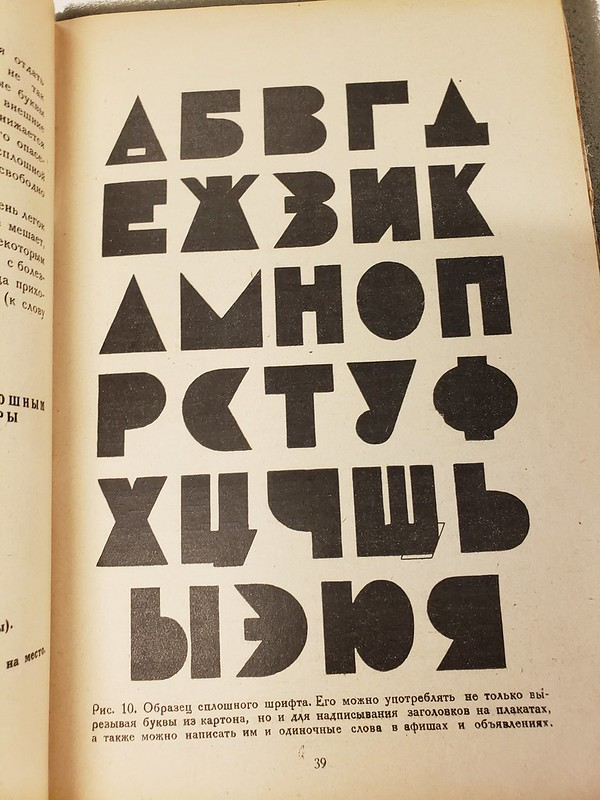

Date/Time: Thursday, 13 February 2020 - 3:00pm to 5:00pmLocation: CESTA (4th floor Wallenberg hall)

Join members of the Stanford DH community, as well as guests visiting for the DLCL's Russian NLP research unit hackathon, for lightning talks followed by DH Happy Hour!

