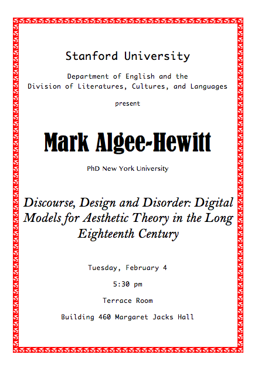

Date/Time: Tuesday, 4 February 2014 - 5:30pmLocation: Terrace Room, Bldg. 460 (Margaret Jacks Hall)

This talk by Mark Algee-Hewitt (Associate Co-director for Research, Stanford Literary Lab) is sponsored by the Stanford's Department of English and Division of Literatures, Cultures, and Languages.

