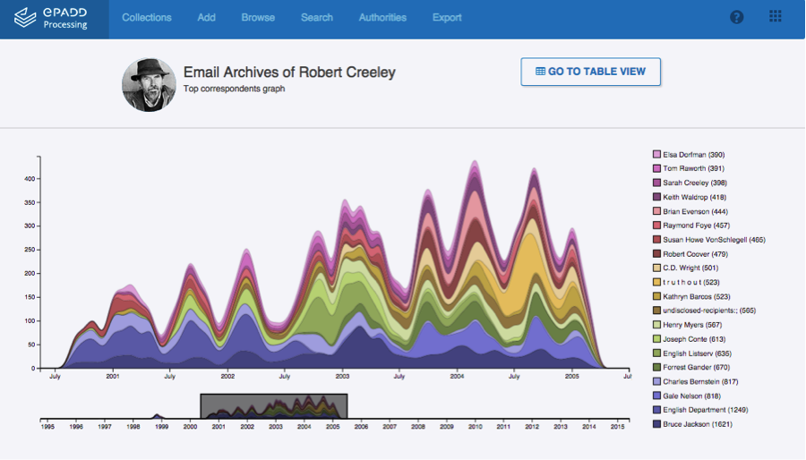
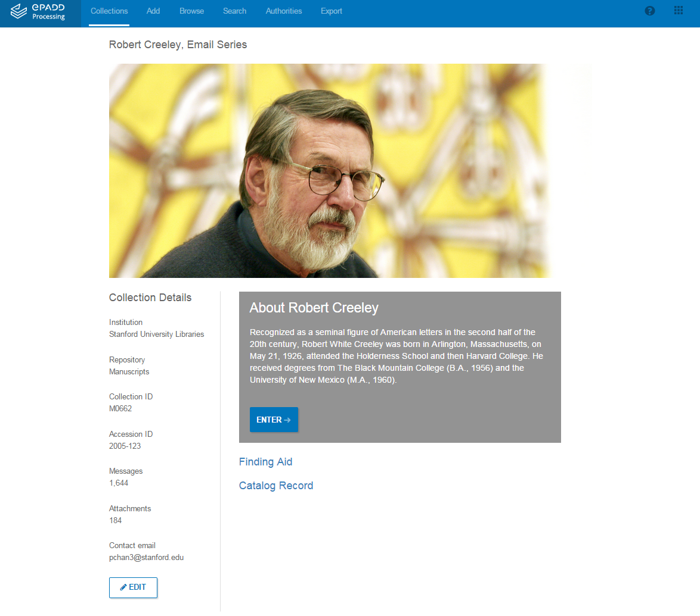

*Email has become a dominant instrument of modern communication -- its content illuminating people's lives, activities, and transactions. Even email headers reveal deep social networks. The archival email collections of recent authors and public figures can thus provide unique windows into contemporary society. ePADD, a new software tool developed by Stanford University Libraries, relies on natural language processing and other computational analytic methods to provide DH researchers with unprecedented access to these important collections.*

Many digital humanities (DH) portals and digital environments (e.g. TAPoR and Voyant) provide researchers with tools to analyze or mine text-based historical sources, such as newspapers, monographs, and other machine-readable texts. This type of extraction enables scholars to gain profound insight into the works of writers and other historical figures, or uncover linguistic and cultural trends. Given the ubiquity of email as a modern communicatory instrument, and its ability to evidence rich social networks through message headers, the email archives of recent authors and other public figures present a medium ripe for similar exploration for DH researchers interested in studying contemporary society.

To date, however, performing DH research on email collections has run from inconvenient to impractical to impossible for two main reasons. First, due to the challenges inherent in reviewing hundreds of thousands of messages to screen for privacy and confidentiality issues, many repositories are simply unable to open up email archives for research. Second, the contextually rich and networked quality of email has made it difficult to harness with existing tools, which are unable to provide for dedicated browsing and visualization of correspondents and named entities mentioned within messages, or promote researcher interaction with the material (such as through annotation or comparative entity analysis). For these reasons, scholars of modern and contemporary history often turn to other sources to support their research, even when the email archive might make methodological sense to include.

Stanford Libraries developed ePADD to help address these problems. ePADD is an open source, [downloadable](https://library.stanford.edu/projects/epadd) software program that harnesses and develops computational analytic methods to automate the process of reviewing email archives and providing access to them. ePADD’s adoption by academic libraries and cultural heritage institutions will help ensure that email archives are discoverable by scholars—providing a potential goldmine of new resources for research into contemporary society.

**How It Works**

ePADD relies on natural language processing (NLP), especially named entity recognition (NER), to enable browsing and visualization of named person, organization, and location entities within email archives. Not satisfied with other open source NER engines, including the Stanford NER and Apache OpenNLP, the ePADD development team created their own engine that integrates new logic to help identify and disambiguate correspondents within the corpus. Extracted entities are linked to their occurrence elsewhere in the archive, allowing for on-the-spot browsing as a researcher navigates the email archive. Further, entities are matched according to a relevance ranking to DBpedia entries, which appear as pop-ups to assist researchers with disambiguation. The ePADD NER ensures persons that occur within the email archive who are also correspondents are weighted more heavily in this ranking.

ePADD’s custom NLP also powers a “query generator,” which supports a comparative entity analysis of the email archive and any other textual document. A researcher can upload any text-block (for instance, a Wikipedia entry, an article, even the full-text of a dissertation or monograph) and see in seconds whether there are any matching named entities that appear in both the uploaded text and the email corpus. Interested in 20th century developments in the history of science? Upload the definitive text on the topic to ePADD and let ePADD tell you in one go whether the corpus contains any related correspondence.

ePADD also embeds functionality for archivists to enact donor restrictions and manage privacy issues when making email archives available to researchers. Often, email archives may only be fully accessible in a special collections reading room due to donor agreement limitations, or third-party privacy and copyright concerns. To support making collection materials discoverable online, ePADD is able to automatically redact contextual information, including email addresses, message headers, message attachments, and non-entities contained within the message. Archivists can then generate a [redacted copy of the corpus](http://epadd.stanford.edu/epadd/collections) for search, browsing, and visualization on a public discovery website. This means a researcher at home or in her office can still search extracted named entities within a collection, even if the underlying message content is not online—allowing her to determine whether a trip to a reading room to view the full email corpus is warranted.

These automated research features provide a far more robust and interactive way for researchers to discover collection content than using traditional online finding aids, the familiar research guides. Typically these guides provide minimal description for email correspondence, e.g. “Box 5: Email correspondence on hard drive.” At a time when most archival repositories are moving away from providing detailed description of materials due to staffing and budgetary shortages, incorporating natural language processing into the processing and delivery workflows allows for message-level retrieval.

Once a researcher has arrived in the reading room, she can access additional functionality within the application, including the ability to: create searchable and exportable annotations for individual messages; view all image attachments (linked to their accompanying messages) within the application; and create complex, tiered, thematic searches using a customizable lexicon tool. This lexicon enables users to easily perform sentiment analysis and other linguistic analyses across the email corpus, and supports visualization of the resulting data over time.

Researchers can then add the annotated email messages to a cart, which can be requested from the repository depending on the terms of the collection and the policies of the institution. Exported messages can be natively delivered in .MBOX file format, a ubiquitous format for email, enabling a researcher to import the messages into their favorite existing email application.

**On the Horizon**

ePADD’s initial release provides broad support for new scholarship using email archives, but there is plenty of room to grow. Future developments may include support for the customizable export of message metadata to enable better integration with other analysis and visualization tools, such as NodeXL or Gephi.

            Also under consideration: the creation of a discovery site uniting all email collections that have been processed worldwide using ePADD. This would means lexicons that researchers create could be saved for reuse across institutions. The query generator in this context would enable a bulk search across all available collections. Imagine if, instead of uploading an article or monograph in the query generator for a single collection, you simply subscribed to a service that notified you with an alert anytime a new archival collection matched your parameters. Think Google Alerts for archival email corpuses. Of course, these tools can also be used for other born-digital or digitized documents. Which means ePADD brings us one step closer to an integrated knowledgebase for all text-based archival materials.

While these build-outs look forward quite a bit, ePADD helps advance DH research toward a new horizon of scholarship about contemporary history and literature, and is now [freely available](https://library.stanford.edu/projects/epadd) and customizable for those eager to explore how it can assist with research.

