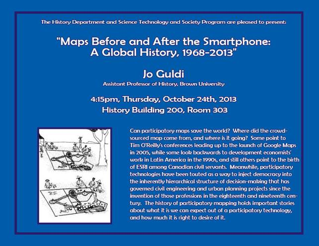

Date/Time: Thursday, 24 October 2013 - 4:15pm to 5:00pmLocation: History Building 200, Room 303

The History Department and Science Technology and Society Program are pleased to present:

"Maps Before and After the Smartphone:

A Global History, 1968-2013"

Jo Guldi

Assistant Professor of History, Brown University

4:15pm, Thursday, October 24th, 2013

History Building 200, Room 303

