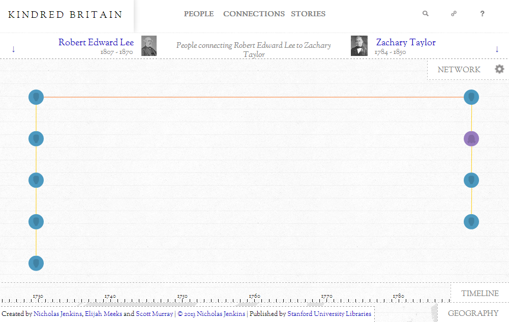

Kindred Britain has a handful of patterns and functions that are rather novel in their creation or deployment. In this series, I'll be exploring the methodology and motivation for them, as well as go into some technical detail as to how they work. The first feature I'd like to focus on is the use of rich permalinks for sharing Kindred Britain. These direct links to particular states of Kindred Britain mean that when you share a link like this:

<http://kindred.stanford.edu/#/path/full/none/none/I17722/I17760/>

..it doesn't just open up Kindred Britain, but rather it opens up a very particular view of Kindred Britain, in this case the genealogical path from General Robert E. Lee to President Zachary Taylor.

When we built ORBIS, we were surprised at how popular it was with social media, and chagrined to find out that many people who shared it thought they were sharing the map 'tab' but instead sent users to the base website. Oftentimes, the instructions were added in the forum comment or Facebook post, e.g. "Click this link and then go to the 'mapping ORBIS' tab." We wanted to avoid this situation with Kindred Britain, but we also wanted to make it more robust, and allow people to link to specific views in the same way you can link to specific routes in Google Maps. As a result, you can open up a specific [family](http://kindred.stanford.edu/#/kin/full/none/none/I19233//), [path](http://kindred.stanford.edu/#/path/full/none/none/I1797/I27868/), or [story](http://kindred.stanford.edu/#/story/half/half/none///tragedy) with permalinks in Kindred Britain.

You should also notice that the layout of the page is stored in the permalink. Knowledge transmission isn't just about data or even queries of the data, it's also about the particular visual formulation that led to the inspiration to share or cite something. The first three terms in the rather cumbersome URL for each Kindred Britain view are simply the layout of each pane--whether it should be fully open, half open, a third of the screen, or closed entirely. While we experimented with storing more state information than that, it proved too cumbersome to implement for the final site.

From a technical perspective, this is all done rather easily in JavaScript. Each time a query is successfully run or a story is successfully loaded or a pane layout is changed, the code updates the window.location.hash in the DOM to match the current settings. The only tricky step is that you need to rebuild your Twitter button each time and then call twttr.widgets.load() to reinitialize it. Rather than go through the same steps with the Facebook and Google+ buttons, and also to contrast the different ways of sharing things, we kept them keyed to the basic Kindred Britain URL.

That's why you'll see  for so many pages. Because that view of the network, the one you're looking at in a very particular configuration, has never been shared on Twitter. While the social sharing is important, what's more important is the idea of citing and deep-linking not just to objects in a database, but configurations of a database or views into a model. These URLs refer not to a particular row in a database or linked data ID but rather a specific query run on the data, or an even more complex state when a story is referred to. This citation form is necessary for the development of scholarship that utilizes interactive scholarly works not only for research but for publication.

