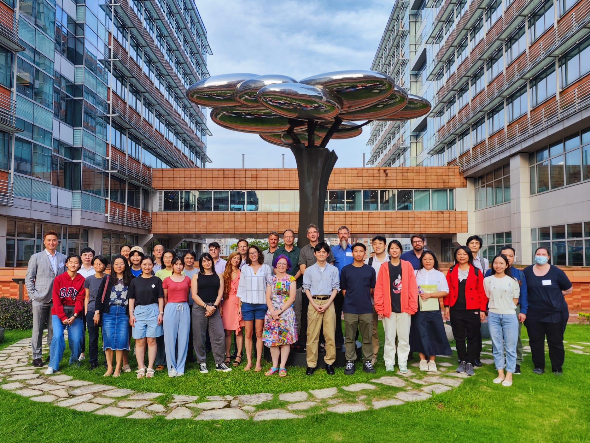
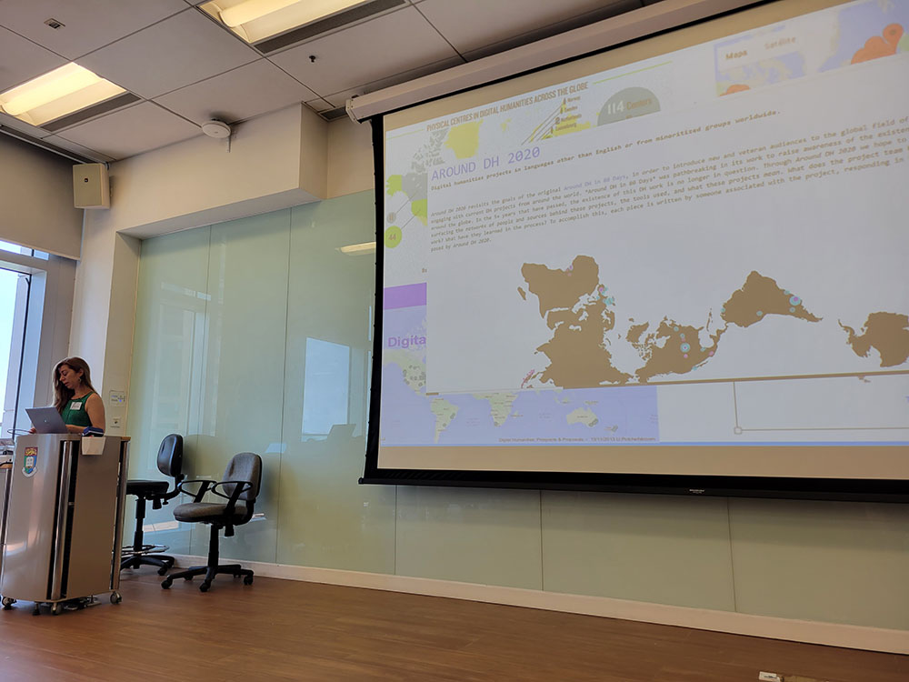
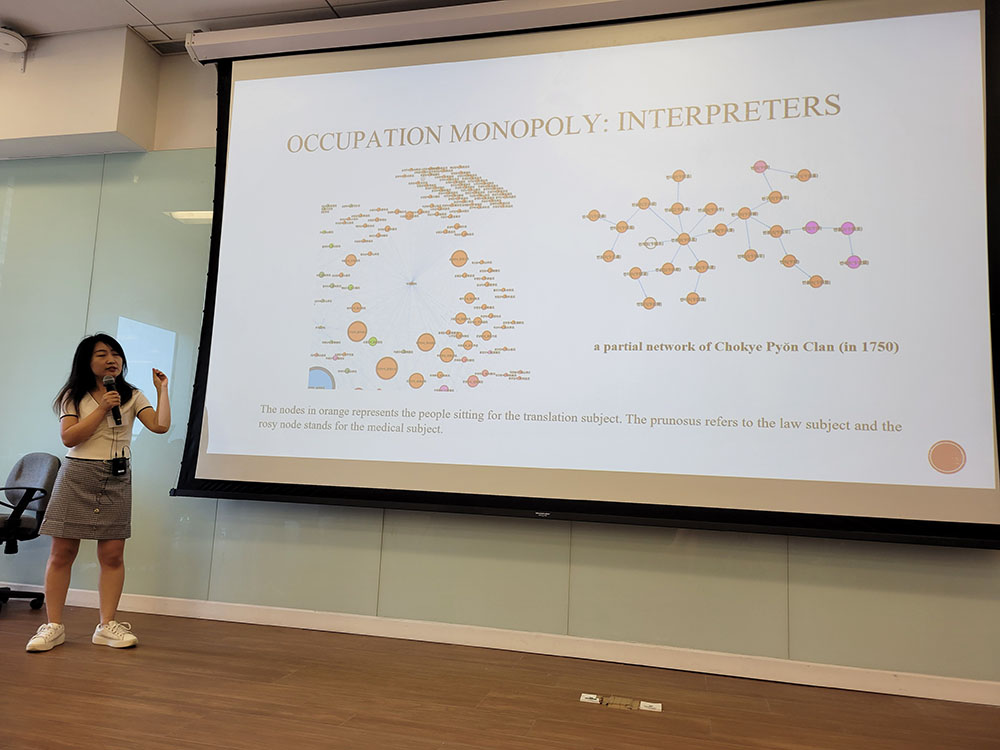
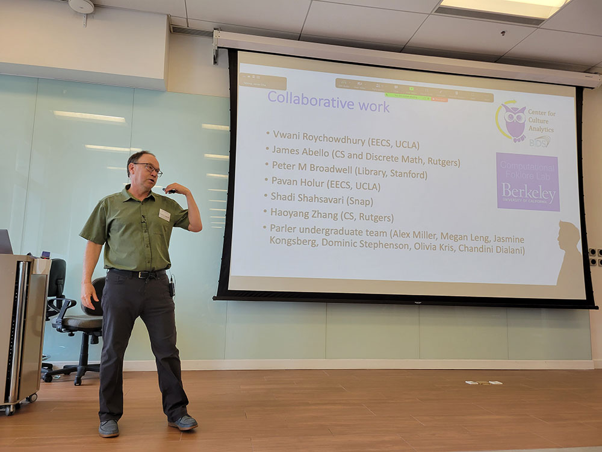
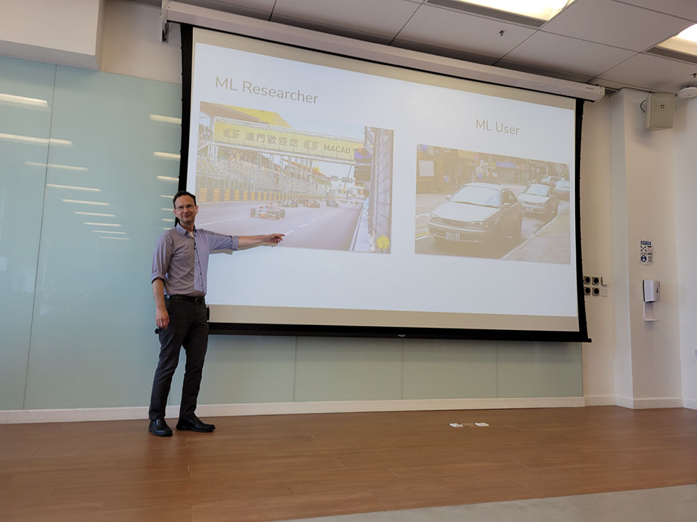
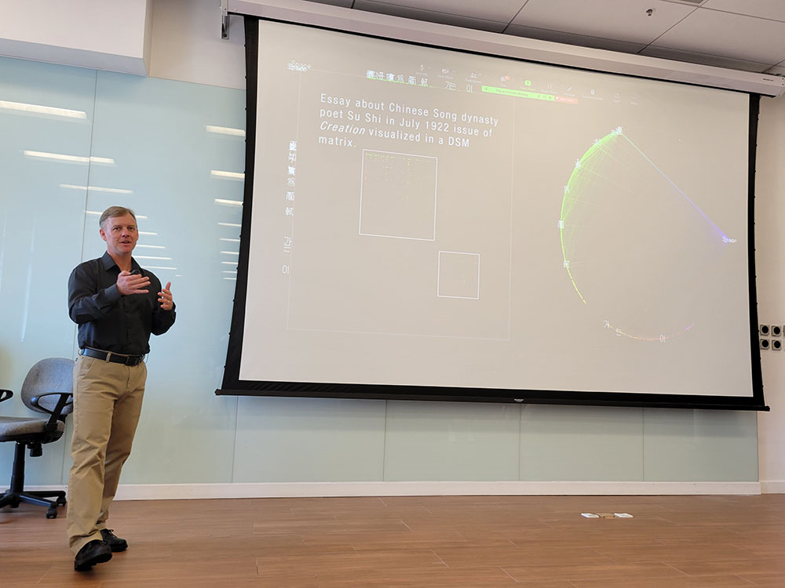

From May 29-June 2, the Bachelor of Arts in Humanities and Digital Technologies program at the University of Hong Kong hosted a workshop on New Horizons in Digital Humanities and Cultural Data Science, organized by Javier Cha and Anya Adair. It was a joy to participate as one of the speakers, presenting on [Saving Ukrainian Cultural Heritage Online](https://www.sucho.org) and the stakes of digital humanities, as well as running a hands-on workshop with Melanie Walsh on [multilingual DH and NLP](https://melaniewalsh.github.io/Intro-Cultural-Analytics/05-Text-Analysis/01-Multilingual-Text-Analysis.html). While I've been at other in-person gatherings since the pandemic, this was the largest DH-oriented event I've been to since 2019, and it was a vivid reminder of how far we have to go in creating viable online spaces for people who don't already know each other well to meet and build the kind of rapport that could foster future collaboration. 

The opening remarks from the dean, Derek Collins, put the workshop into an institutional context: HKU is looking to build a digital humanities program that would be a peer to any of the major programs across the globe, but with a distinctly Asian perspective. It's refreshing to see this that this view has evolved into the kind of common wisdom that appears in a dean's remarks: there is no monolithic "DH", and whatever we do is shaped by the many facets of our own personal, local, and regional context. This point was again emphasized by Gimena del Rio Riande in the first presentation of the workshop, when she stated explicitly that an "international DH" does not exist. Trying to make one, in practice, amounts to nothing more than codifying one set of (typically Anglo-American) practices as "international DH" and imposing them on everyone else as a standard that may make no sense in other regional contexts.

Working across several fields and languages in DH meant I was lucky to already know most of the speakers. The lineup included folks from computer science, information studies, and East Asian studies, who were involved in the international DH scene to varying extents. Jing Hu's presentation on historical Korean social mobility was the kind of thing I really enjoy about DH events: learning about a topic I'd likely never be exposed to otherwise, embedded in a discussion about a tool I might be able to incorporate into the projects I support in a different field. Similarly, Mark Byington's talk on using GIS and historical imagery to recover "lost landscapes" (and places with restricted access, like North Korea) got me thinking about the materiality of historical images, and marveling at the engineering that went into clandestine 20th century aerial photography rigs.

Graph databases and networks were a shared theme across multiple presentations and workshops. Tim Tangherlini spoke about network methods for understanding conspiracy theories, and Jeff Tharsen presented on the [OCHRE platform](https://voices.uchicago.edu/crescat/) which atomizes and links knowledge across several UChicago projects and will be the basis of a broader project / data publishing initiative. Jeff's workshop on identifying and visualizing intertextuality, building upon UChicago's [ARTFL Project](https://artfl-project.uchicago.edu/), got me thinking about potential uses across several of my projects, in multiple languages.

Large language models were a focus of several talks and workshops, and sat in the background for others, including mine. Wayne de Fremery considered the different meanings of "deep learning" (both the technical jargon and something like PhD training). Tim Tangherlini's hands-on workshop involved using BERTopic for narrative analysis. David Mimno's talk was a deep dive into some of the current major LLMs, and an insightful take on the relationship between cutting-edge work on model training and what humanists are looking for from their tools. His hands-on workshop led us into the bizarre world of LLM training, where cutting the training iterations in half (due to time constraints) left us not with the extracted entities we were going for, but instead, a halfway decent translator of prompts into German. As someone planning to teach a course on AI in the fall with Laura Wittman, I was excited to hear about new materials coming from the [BERT for Humanists](https://www.bertforhumanists.org/) project over the summer.

There was also a thread of creative making that ran through the event, which was a particular delight given where my head has been this quarter while teaching a "Data Visualization with Textiles" course. On Monday, I held a brief lunchtime session on textile data visualization, and over the course of the whole week, I collaborated with attendees on a data viz that I [wrote up on the Textile Makerspace blog](https://textilemakerspace.stanford.edu/blog/hku-new-horizons-dataviz/). Wayne's talk on deep learning also included a series of creative explorations of the Unicode code space, with Korean texts rendered as images, 3D printed jewelry, and even a virtual reality landscape. As it often happens, it takes a trip across the world to meet your neighbors; I'm looking forward to future collaboration with Wayne, who's also based in the Bay Area.

The first cohort of students have wrapped up their first year in the Bachelor of Arts in Humanities and Digital Technologies program, and there was an interesting roundtable discussion on curriculum and how these programs should be structured. The students had an introductory crash course on all things DH with Javier Cha before continuing their coursework in "regular" stats and coding classes. It's a lot to ask of undergrads, who also have to choose an area of the humanities to focus on, but the students I met had risen to the occasion. I was surprised to learn that the students who helped run the event were all early-stage undergrads, and not grad students.

It's exciting to see a program like this at its beginning, and to be part of the conversations that will likely shape its direction. I'd love to have the opportunity to go back for a summer program at some point, or collaborate in other ways. (Once their DH lab is set up, if they add a creative making component, maybe they could be pen pals with the Textile Makerspace!) I'm grateful to Javier for the invitation, and for his support given the potentially sensitive nature of what I was presenting (i.e. protecting Ukrainian cultural heritage, as well as a data set of uncensored multilingual fanfic). With spring wrapping up, this trip was exactly what I needed to get excited again about the projects I'm working on, and face the summer with enthusiasm, new ideas, and new avenues of collaboration.

