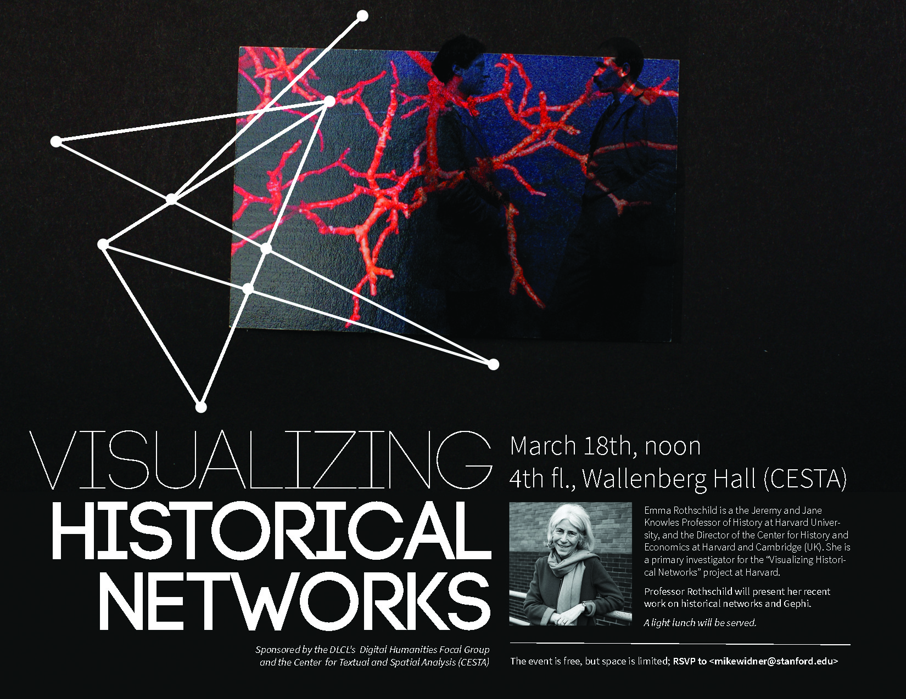

Date/Time: Tuesday, 18 March 2014 - 12:00pmLocation: Wallenberg Hall, 4th floor, Room 433A

Emma Rothschild is a the Jeremy and Jane Knowles Professor of History at Harvard University,

and the Director of the Center for History and Economics at Harvard and Cambridge (UK). She is

a primary investigator for the “Visualizing Historical Networks” project at Harvard.

Professor Rothschild will present her recent work on historical networks and Gephi.

Sponsored by the DLCL's Digital Humanities Focal Group and the Center for Textual and Spatial Analysis (CESTA).

The event is free, but space is limited; RSVP to <[mikewidner@stanford.edu](mailto:mikewidner@stanford.edu)>

